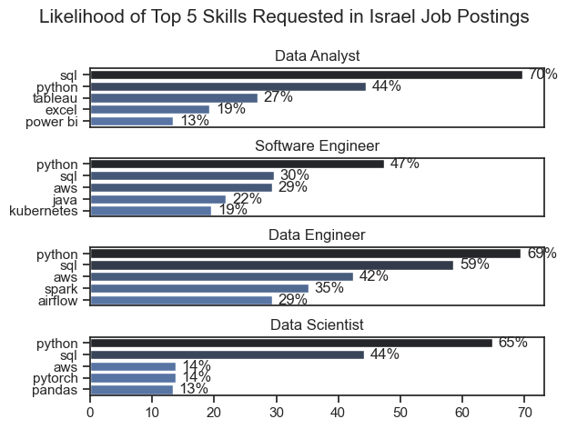
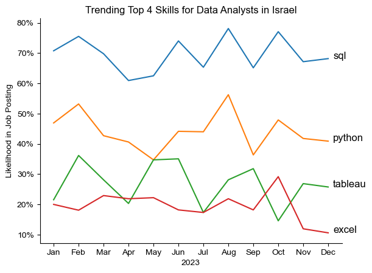
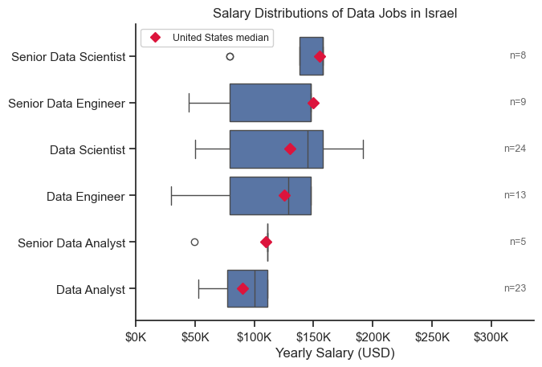
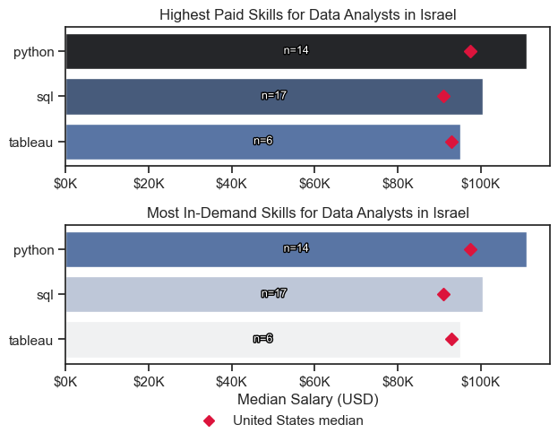
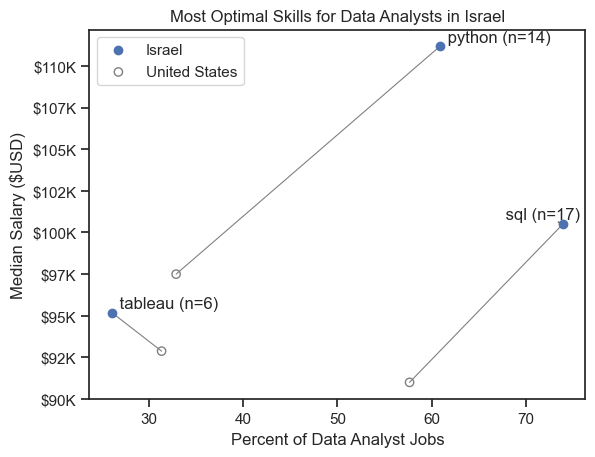
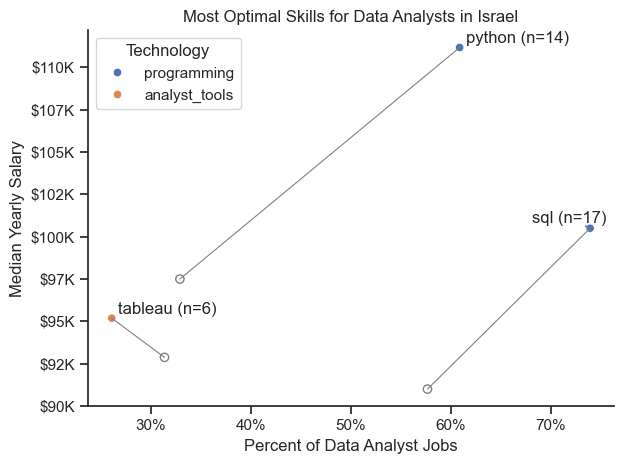

# Overview

Welcome to my analysis of the data job market, focusing on data analyst roles. This project was created out of a desire to navigate and understand the job market more effectively. It delves into the top-paying and in-demand skills to help find optimal job opportunities for data analysts.

The data sourced from [Luke Barousse's Python Course](https://lukebarousse.com/python) which provides a foundation for my analysis, containing detailed information on job titles, salaries, locations, and essential skills. Through a series of Python scripts, I explore key questions such as the most demanded skills, salary trends, and the intersection of demand and salary in data analytics.

> **Note:** this write-up describes the analysis as configured by default — `SELECTED_COUNTRY = "Israel"` and `BENCHMARK_COUNTRY = "United States"` in [`03_Project/config.py`](03_Project/config.py). Point `config.py` at another market and the notebooks re-run against it, but this narrative won't follow automatically.

# The Questions

Below are the questions I want to answer in my project:

1. What are the skills most in demand for the top 4 most popular data roles?
2. How are in-demand skills trending for Data Analysts?
3. How well do jobs and skills pay for Data Analysts?
4. What are the optimal skills for data analysts to learn? (High Demand AND High Paying) 

# Tools I Used

For my deep dive into the data analyst job market, I harnessed the power of several key tools:

- **Python:** The backbone of my analysis, allowing me to analyze the data and find critical insights. I also used the following Python libraries:
    - **Pandas Library:** This was used to analyze the data. 
    - **Matplotlib Library:** I visualized the data.
    - **Seaborn Library:** Helped me create more advanced visuals. 
- **Jupyter Notebooks:** The tool I used to run my Python scripts which let me easily include my notes and analysis.
- **Visual Studio Code:** My go-to for executing my Python scripts.
- **Git & GitHub:** Essential for version control and sharing my Python code and analysis, ensuring collaboration and project tracking.

# Setup & Reproduce

To run this analysis yourself you need **Python 3.11** (the version it was tested with) and **Git**.

```bash
# 1. Clone the repo and move into it
git clone <your-repo-url>
cd <repo-folder>

# 2. Create and activate an isolated virtual environment
python -m venv .venv
source .venv/bin/activate          # Windows: .venv\Scripts\activate

# 3. Install the pinned dependencies
pip install -r requirements.txt

# 4. Launch Jupyter
jupyter lab
```

Then open the notebooks in [`03_Project/`](03_Project/) and run them in order, `1_EDA_Intro` through `5_Optimal_Skills`. (Alternatively, open the folder in VS Code and run the notebooks with the Jupyter extension, selecting `.venv` as the kernel.)

The first notebook you run calls `load_data()` from [`03_Project/load_data.py`](03_Project/load_data.py). On the first call it downloads the [`lukebarousse/data_jobs`](https://huggingface.co/datasets/lukebarousse/data_jobs) dataset from Hugging Face, cleans it, and caches the result to `03_Project/data/data_jobs.parquet`. Every later call reads that local cache, so the download only happens once.

# Data Preparation and Cleanup

This section outlines the steps taken to prepare the data for analysis, ensuring accuracy and usability.

## Import & Clean Up Data

Each notebook starts by importing the libraries and loading the data. The download and cleaning steps live in a single helper, [`03_Project/load_data.py`](03_Project/load_data.py), so every notebook begins from the same cleaned DataFrame:

```python
# Importing libraries
import pandas as pd
import matplotlib.pyplot as plt
import seaborn as sns

from load_data import load_data

# Load the cleaned dataset (downloads once, then reads a local cache)
df = load_data()
```

Inside `load_data()` the cleanup converts `job_posted_date` to a real datetime and parses the `job_skills` text (e.g. `"['sql', 'python']"`) into actual Python lists.

## Filter to One Country

The market to analyse is set once in [`03_Project/config.py`](03_Project/config.py) (default: Israel) and every notebook imports it, so the whole analysis retargets from a single place:

```python
from config import SELECTED_COUNTRY

df_country = df[df['job_country'] == SELECTED_COUNTRY]
```

# The Analysis

Each Jupyter notebook for this project aimed at investigating specific aspects of the data job market. Here’s how I approached each question:

## 1. What are the most demanded skills for the top 4 most popular data roles?

To find the most demanded skills for the top 4 most popular data roles, I filtered to the 4 most common job titles and took the top 5 skills for each. This highlights which skills to pay attention to depending on the role I'm targeting. 

View my notebook with detailed steps here: [2_Skill_Demand](03_Project/2_Skill_Demand.ipynb).

### Visualize Data

```python
fig, ax = plt.subplots(len(job_titles), 1)


for i, job_title in enumerate(job_titles):
    df_plot = df_skills_count[df_skills_count['job_title_short'] == job_title].head(top_n_skills)[::-1]
    sns.barplot(data=df_plot, x='skill_percent', y='job_skills', ax=ax[i], hue='skill_count', palette='dark:b_r')

plt.show()
```

### Results



*Bar graphs showing how often each of the top 5 skills appears in postings for the 4 most common roles in the Israeli data job market.*

### Insights:

- SQL is the most requested skill for Data Analysts (~70% of postings); for every other role shown, Python is first, peaking at ~69% for Data Engineers and ~65% for Data Scientists.
- Data Engineers lean on more specialised infrastructure skills (AWS ~42%, Spark ~35%, Airflow ~29%), while Data Analysts skew toward general analysis tools (Tableau ~27%, Excel ~19%).
- Python is the common thread across all 4 roles; SQL is a strong second everywhere except Data Analyst, where it leads.

## 2. How are in-demand skills trending for Data Analysts?

To find how skills are trending in 2023 for Data Analysts, I filtered data analyst positions and grouped the skills by the month of the job postings. This got me the top skills of data analysts by month, showing how popular skills were throughout 2023.

View my notebook with detailed steps here: [3_Skills_Trend](03_Project/3_Skills_Trend.ipynb).

### Visualize Data

```python

from matplotlib.ticker import PercentFormatter

df_plot = df_country_percent.iloc[:, :top_n_skills]
sns.lineplot(data=df_plot, dashes=False, legend='full', palette='tab10')

plt.gca().yaxis.set_major_formatter(PercentFormatter(decimals=0))

plt.show()

```

### Results

  
*Line chart of the trending top skills for data analysts in Israel across 2023.*

### Insights:
- SQL is the most in-demand skill in every month of 2023, holding a fairly steady ~60–78% of Data Analyst postings and drifting slightly upward over the year.
- Python is a clear second, moving in a ~35–56% band with more month-to-month noise than SQL.
- Tableau and Excel swap third place repeatedly, both in the ~10–36% range; Excel spikes to ~29% in October before falling back near ~11% by December.
- The lines are built from the normalised `job_title_short` category (~900 Israeli Data Analyst postings) — about 3 times the sample the exact-title filter used previously.

## 3. How well do jobs and skills pay for Data Analysts?

To identify the highest-paying roles and skills, I only got jobs in Israel and looked at their median salary. But first I looked at the salary distributions of common data jobs like Data Scientist, Data Engineer, and Data Analyst, to get an idea of which jobs are paid the most. 

View my notebook with detailed steps here: [4_Salary_Analysis](03_Project/4_Salary_Analysis.ipynb).

#### Visualize Data 

```python
sns.boxplot(data=df_country_top, x='salary_year_avg', y='job_title_short', order=job_order)

ticks_x = plt.FuncFormatter(lambda y, pos: f'${int(y/1000)}K')
plt.gca().xaxis.set_major_formatter(ticks_x)
plt.show()

```

#### Results

  
*Box plot visualizing the salary distributions for the Data Analyst/Scientist/Engineer and their respective Senior job titles.*

#### Insights

- Median pay tracks seniority and specialisation: Senior Scientist/Engineer roles are highest (~$148–158K), then the mid-level Scientist/Engineer roles, with Data Analyst lowest (~$100K).

- Several job titles rest on only a handful of postings (shown as `n=` on the chart), so read the box widths and outliers cautiously; the crimson diamonds mark the United States median for the same role as a reference point.

- Against that US reference the Israeli medians hold up well: the senior roles land within ~2% of the US, while mid-level Data Scientist ($145K vs $130K) and Data Analyst ($100.5K vs $90K) sit ~12% above it — indicative rather than conclusive on samples of n=5–24.

### Highest Paid & Most Demanded Skills for Data Analysts

Next, I narrowed my analysis and focused only on data analyst roles. I looked at the highest-paid skills and the most in-demand skills. I used two bar charts to showcase these.

#### Visualize Data

```python

fig, ax = plt.subplots(2, 1)

# Highest-paid skills for Data Analysts
sns.barplot(data=df_country_da_top_pay, x='median', y=df_country_da_top_pay.index, hue='median', ax=ax[0], palette='dark:b_r')

# Most in-demand skills for Data Analysts
sns.barplot(data=df_country_da_top_skills, x='median', y=df_country_da_top_skills.index, hue='median', ax=ax[1], palette='light:b')

plt.show()

```

#### Results
Here's the breakdown of the highest-paid & most in-demand skills for data analysts in Israel:


*Two separate bar graphs visualizing the highest paid skills and most in-demand skills for data analysts in Israel. Each bar is annotated with `n` (postings behind the median); a crimson diamond marks the United States median for that skill.*

#### Insights:

- Only 3 of the 17 skills in Israeli Data Analyst postings clear the reliability floor (≥ 5 salaried postings): `python` (n=14), `sql` (n=17) and `tableau` (n=6); the other 14 are dropped rather than ranked on one or two data points.

- With so few skills left, the "highest paid" and "most in-demand" lists are identical — all 3 are core toolkit skills, not niche specialities.

- Each of the 3 pays above its United States median: `python` +14% ($111K vs $97.5K), `sql` +10% ($100.5K vs $91K), `tableau` +2% ($95.2K vs $92.9K).

## 4. What are the most optimal skills to learn for Data Analysts?

To identify the most optimal skills to learn ( the ones that are the highest paid and highest in demand) I calculated the percent of skill demand and the median salary of these skills. To easily identify which are the most optimal skills to learn. 

View my notebook with detailed steps here: [5_Optimal_Skills](03_Project/5_Optimal_Skills.ipynb).

#### Visualize Data

```python
# sel / bench: one row per skill (skill_percent, median_salary) for
# SELECTED_COUNTRY and BENCHMARK_COUNTRY respectively

plt.scatter(sel['skill_percent'], sel['median_salary'], label=SELECTED_COUNTRY)
plt.scatter(bench['skill_percent'], bench['median_salary'],
            facecolors='none', edgecolors='gray', label=BENCHMARK_COUNTRY)

# join each skill's two points so the demand/pay shift is visible
for s in sel.index:
    plt.plot([sel.loc[s, 'skill_percent'], bench.loc[s, 'skill_percent']],
             [sel.loc[s, 'median_salary'], bench.loc[s, 'median_salary']], color='gray', lw=0.8)

plt.legend()
plt.show()
```

#### Results

    
*A scatter plot visualizing the most optimal skills (high paying & high demand) for data analysts in Israel. Hollow points joined by a line show the same skills in the United States.*

#### Insights:

- `sql` and `python` are the stand-out optimal skills: both near the top of the demand axis (~74% and ~61% of postings) and the top of the pay range (~$100.5K and ~$111K).

- Both sit well up and to the right of their United States counterparts — `python` is ~28 points more common and ~$14K better paid in Israel, `sql` ~16 points and ~$9K — so the local market rewards them more, not less.

- `tableau` is the third reliable skill: ~26% of postings and ~$95K, landing almost exactly on top of its US point.

### Visualizing Different Technologies

Let's visualize the different technologies as well in the graph. We'll add color labels based on the technology (e.g., {Programming: Python})

#### Visualize Data

```python
from matplotlib.ticker import PercentFormatter

# Create a scatter plot
scatter = sns.scatterplot(
    data=df_country_da_skills_tech_high_demand,
    x='skill_percent',
    y='median_salary',
    hue='technology',  # Color by technology
    palette='bright',  # Use a bright palette for distinct colors
    legend='full'  # Ensure the legend is shown
)
plt.show()

```

#### Results

  
*A scatter plot visualizing the most optimal skills (high paying & high demand) for data analysts in Israel with color labels for technology.*

#### Insights:

- After the reliability floor only two technology groups remain: `programming` (`sql`, `python`) and `analyst_tools` (`tableau`).

- The two programming skills sit at the top-right — highest demand and highest pay — while the single analyst-tool skill, `tableau`, trails on both axes.

- Database, cloud and library skills all fall below the 5-posting floor for Israeli Data Analysts, so the "optimal" set here is effectively the core programming pair plus Tableau; a larger market (via `config.py`) would surface a richer picture.

# What I Learned

Throughout this project, I deepened my understanding of the data analyst job market and enhanced my technical skills in Python, especially in data manipulation and visualization. Here are a few specific things I learned:

- **Advanced Python Usage**: Utilizing libraries such as Pandas for data manipulation, Seaborn and Matplotlib for data visualization, and other libraries helped me perform complex data analysis tasks more efficiently.
- **Data Cleaning Importance**: I learned that thorough data cleaning and preparation are crucial before any analysis can be conducted, ensuring the accuracy of insights derived from the data.
- **Strategic Skill Analysis**: The project emphasized the importance of aligning one's skills with market demand. Understanding the relationship between skill demand, salary, and job availability allows for more strategic career planning in the tech industry.


# Insights

This project provided several general insights into the data job market for analysts:

- **Skill Demand and Salary Correlation**: There is a clear link between how often a skill is asked for and what it pays. For Israeli Data Analysts the programming skills (SQL, Python) sit at the top of both axes, and each pays above its United States equivalent.
- **Market Trends**: There are changing trends in skill demand, highlighting the dynamic nature of the data job market. Keeping up with these trends is essential for career growth in data analytics.
- **Economic Value of Skills**: Understanding which skills are both in-demand and well-compensated can guide data analysts in prioritizing learning to maximize their economic returns.


# Challenges I Faced

This project was not without its challenges, but it provided good learning opportunities:

- **Data Inconsistencies**: Handling missing or inconsistent data entries requires careful consideration and thorough data-cleaning techniques to ensure the integrity of the analysis.
- **Complex Data Visualization**: Designing effective visual representations of complex datasets was challenging but critical for conveying insights clearly and compellingly.
- **Balancing Breadth and Depth**: Deciding how deeply to dive into each analysis while maintaining a broad overview of the data landscape required constant balancing to ensure comprehensive coverage without getting lost in details.


# Conclusion

This exploration into the data analyst job market has been incredibly informative, highlighting the critical skills and trends that shape this evolving field. The insights I got enhance my understanding and provide actionable guidance for anyone looking to advance their career in data analytics. As the market continues to change, ongoing analysis will be essential to stay ahead in data analytics. This project is a good foundation for future explorations and underscores the importance of continuous learning and adaptation in the data field.


